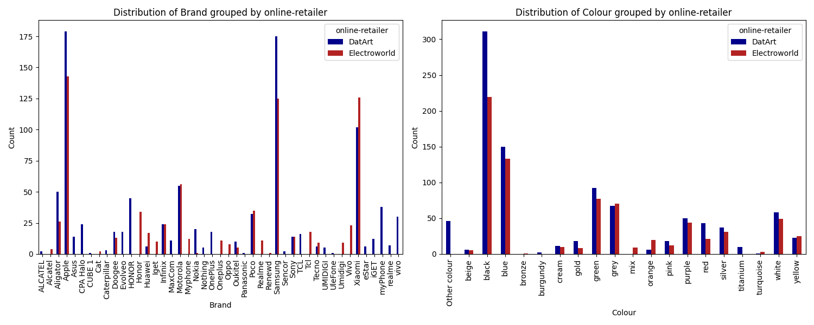
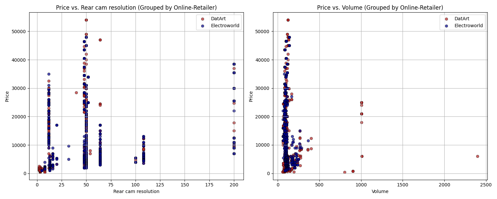
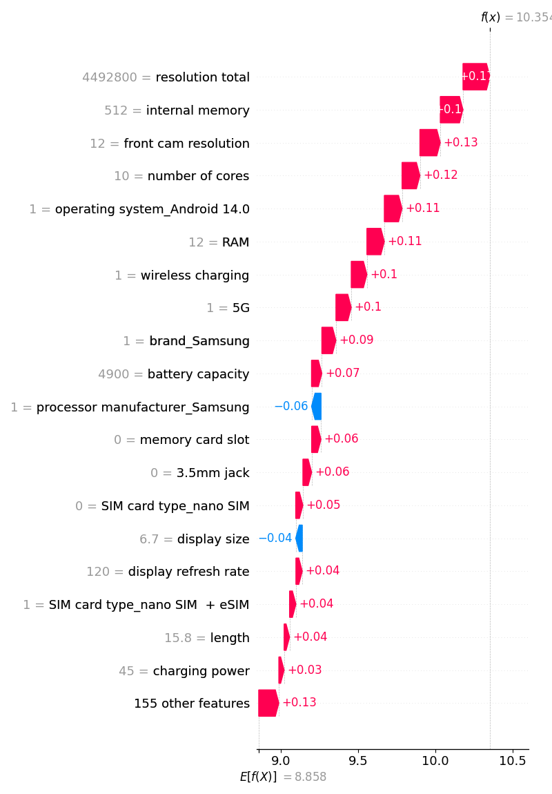
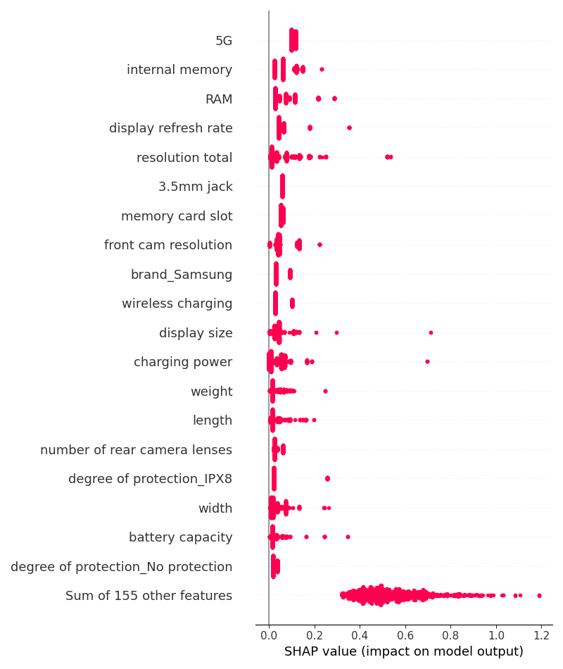
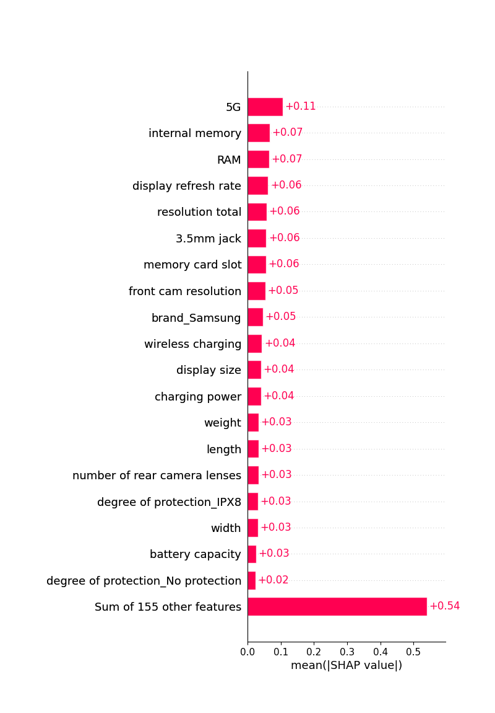
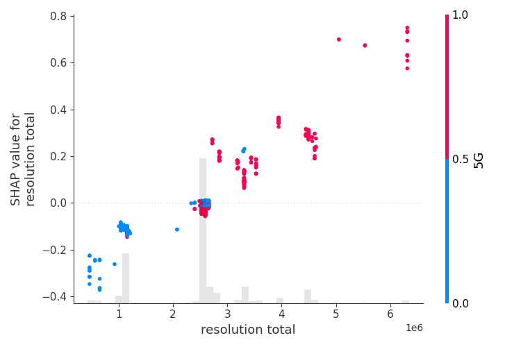
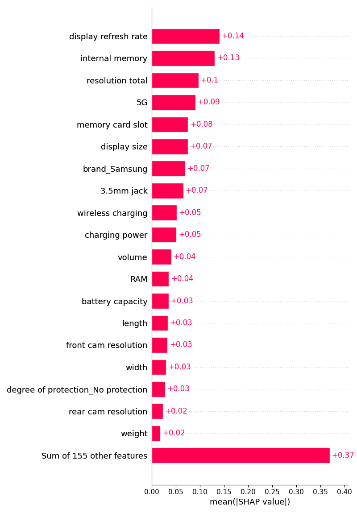

# Data-Processing-Project

This final project is part of the Data Processing in Python (JEM207) course at IES.
This project is about scraping, processing and analyzing mobile phone data, utilizing the python programming language.
Precisely, we scrape data from two Czech online retailers using the BeautifulSoup library. During the data processing 
stage we try to transform data from multiple sources into a uniform format. Finally, multiple phone characteristics are 
used to draw conclusions about phone prices.

## Runnability  
### main.py
The "main.py" file includes the whole pipeline from scraping and processing the data to data integration and data analysis. 
Only this file needs to be executed.
### ChromeDriver Installation
1. Download the [ChromeDriver]([https://sites.google.com/chromium.org/driver/](https://chromedriver.chromium.org/downloads)) executable compatible with your Chrome browser version.
2. Place the downloaded directory unzipped in a directory that is included in your system's PATH.

### Variables Across Datasets
| Variable | Data Type | DatArt | Electroworld |
|----------|----------|----------|----------|
| title | string | ✅ | ✅ |
| online-retailer | string | ✅ | ✅ |
| price | integer (CZK) | ✅ | ✅ |
| rating | float | ✅ | ✅ |
| number of ratings | int | ✅ | ✅ |
| display size | float (inches) | ✅ | ✅ |
| resolution width | integer (pixels) | ✅ | ✅ |
| connector | string | ✅ | ✅ |
| resolution height | integer (pixels) | ✅ | ✅ |
| resolution total | integer (pixels) | ✅ | ✅ |
| display refresh rate | integer (Hertz) | ✅ | ✅ |
| processor manufacturer | string | ✅ | ✅ |
| processor model | string | ✅ | ✅ |
| number of cores | integer | ✅ | ✅ |
| SIM card type | string | ✅ | ✅ |
| configuration cards | string | ✅ | ✅ |
| degree of protection | string | ✅ | ✅ |
| operating system | string | ✅ | ✅ |
| internal memory | integer (GB) | ✅ | ✅ |
| RAM | integer (GB) | ✅ | ✅ |
| charging power | int (Watt) | ✅ | ✅ |
| battery capacity | integer (mAh) | ✅ | ✅ |
| memory card slot | boolean | ✅ | ✅ |
| 4G/LTE | boolean | ✅ | ✅ |
| GPS | boolean | ✅ | ✅ |
| Wi-Fi | boolean | ✅ | ✅ |
| 5G | boolean | ✅ | ✅ |
| NFC | boolean | ✅ | ✅ |
| Bluetooth | boolean | ✅ | ✅ |
| number of rear camera lenses | integer | ✅ | ✅ |
| number of front camera lenses | integer | ✅ | ✅ |
| rear cam resolution | float (pixels) | ✅ | ✅ |
| front cam resolution | float (pixels) | ✅ | ✅ |
| fast charging | boolean | ✅ | ✅ |
| wireless charging | boolean | ✅ | ✅ |
| body fingerprint reader | boolean | ✅ | ✅ |
| face unlock | boolean | ✅ | ✅ |
| in-display fingerprint reader | boolean | ✅ | ✅ |
| 3.5mm jack | boolean | ✅ | ✅ |
| FM-radio | boolean | ✅ | ✅ |
| colour | string | ✅ | ✅ |
| brand | string | ✅ | ✅ |
| width | float (cm) | ✅ | ✅ |
| length | float (cm) | ✅ | ✅ |
| depth | float (cm) | ✅ | ✅ |
| volume | float (cubic cm) | ✅ | ✅ |
| weight | float (grams) | ✅ | ✅ |
| cutout shape | string | ✅ | ❌ |
| processor frequency | float (Gigahertz) | ✅ | ❌ |
| system superstructure | string | ✅ | ❌ |
| notification diode | boolean | ✅ | ❌ |
| maximum memory card size | integer | ✅ | ❌ |
| Galileo | boolean | ✅ | ❌ |
| Beidou | boolean | ✅ | ❌ |
| A-GPS | boolean | ✅ | ❌ |
| infrared | boolean | ✅ | ❌ |
| GLONASS | boolean | ✅ | ❌ |
| Bokeh effect | boolean | ✅ | ❌ |
| auto focus | boolean | ✅ | ❌ |
| thermal camera | boolean | ✅ | ❌ |
| wide angle lens | boolean | ✅ | ❌ 
| macro mode | boolean | ✅ | ❌ |
| night mode | boolean | ✅ | ❌ |
| optical zoom | boolean | ✅ | ❌ |
| telephoto | boolean | ✅ | ❌ |
| hybrid zoom | boolean | ✅ | ❌ |
| flash diode | boolean | ✅ | ❌ |
| battery type | string | ✅ | ❌ |
| removable battery | boolean | ✅ | ❌ |
| reverse wireless charging | boolean | ✅ | ❌ |
| without fingerprint reader | boolean | ✅ | ❌ |
| warranty | int (months) | ✅ | ❌ |
| bluetooth version | string | ❌ | ✅ |
| WiFi standard | string | ❌ | ✅ |
| display type | string | ❌ | ✅ |
| resolution label | string | ❌ | ✅ |
| display fineness | integer (PPI) | ❌ | ✅ |
| smart | boolean | ❌ | ✅ |
| water resistant | boolean | ❌ | ✅ |
| os brand | string | ❌ | ✅ |
| dual SIM support | boolean | ❌ | ✅ |
| built-in flash | boolean | ❌ | ✅ |
| flash type | string | ❌ | ✅ |
| front cam | boolean | ❌ | ✅ |
| wireless charging performance | integer (Watt) | ❌ | ✅ |

### Data Analysis - Summary Statistics and Visualizations
The main focus lies on the price variable. For simple analysis some typical summary statistics were calculated for the price variable and some other interesting characteristics. The complete data set, consisting of data from two sources DatArt and Electroworld, contains 1687 rows and 48 variables. 
The prices of mobile phones vary between 449 and 53990 crowns with a mean 12140,03 crowns, giving a first hint for right-skewness (see table below). Most metric variables contain less than 100 NA's and therefore serves as variables for price modelling. An exception is the variable rating with more than 500 NA's. 
#### Summary Statistics for Metric Variables

#### Table - Online - Retailer

In total there are 950 (736) products included from DatArt (Electroworld). 

#### Table - Brands

Most of the products belong to Apple (19%) followed by Samsung (17,7%) and Xiaomi (13,5%).

#### Table - Processors

The processors of the products were mostly manufacturer by Mediathek (24,4%) and Apple (19,2%).

#### Table - Summary Statistics Grouped by Online-Retailer

Some grouped metrics were calculated for the retailers. The average price of mobile phones does not vary much between the two retailers and lies around 12000 crowns. Further, the company with the most supplied products on the websites is apple in both cases. The most supplied colour of a phone is black in both cases. However, the number of ratings is much higher for DatArt (20058) than for Electroworld (1816), given a hint that the first website is used more often for buying phones.

#### Bar Plots - Colours and Brands Grouped by Online-Retailer

The brands are allocated quite similar for both websites. However, Electroworld supplies Samsung more often than Xiaomi phones compared to DatArt. The colours are also allocated quite equally. 

#### Pie Plots - Share of Products with Wireless Charging and Shares of Connectors

More than half of all products include no wireless charging (64,6%) and the most supplied connector for phones is USB-c (75,4%).

#### Scatter Plots - Prices vs. Rear Cam Resolution and Price vs. Volume (Grouped by Online-Retailer)

Prices seem to have a slight positive association with the rear cam resolution. However, there are also some products with a very high rear cam resolution but a more average price. In this association there seems to be no big difference between the two websites. The volume of a product seems to have almost no influence on prices. It is comparably low for high and low price phones.

#### Scatter Plots - Prices vs. Display Size and Price vs. Total Resolution in PX (Grouped by Brand)

There seems to be a positive relationship between prices and display size. Samsung products seem to have higher display sizes on average compared to Apple and Xiaomi products. Xiaomi products have many display sizes around the average not showing any relationship, while maintaining comparably low prices.
Also between the variables resolution (resolution width x resolution height) and price seems to be a positive relationship. This seems to be the case for all three brands.

#### Histograms - Prices (Grouped by Brand)

The prices are normally distributed for Xiaomi products and right-skewed for Apple and Samsung products.

#### Histograms - Prices (Grouped by Online-Retailer)

For both online-retailers the prices are right-skewed.

#### Heatmap - Correlations of Metric Variables

Some logical high correlations exist between the resolution width, resolution height and resolution total and the between the physical measures (length, width, depth, weight and volume). The price variable has a noticable high positive correlation with the total resolution, internal memory and the RAM.

### Data Analysis - Modelling
First, a Generalized Additive Model was estimated using InterpretMLs explainable boosting machines. For this type of model the Shapley values can be estimated. For all features their sum can be interpeted as the difference between the baseline (expected) model output and the current model output for a certain prediction point. Therefore, they have an additive nature and each features contribution to the overall difference between expectation and model output can be interpred quantitatively.
For the analysis some variables showing a clear behaviour of multicollinearity were removed (resolution width and resolution height). Some other variables containing too many categories or NA's were also removed (rating, number or ratings, configuration cards, title, processor model). 
Further, the logarithm was applied to the dependent variable to obtain normally distributed prices. 

#### GAM - Partial Dependence Plot (Total Resolution, Datapoint: 40)

For this GAM, the Shapley value can be directly seen as the difference between the blue (model) line and the expected model output is represented by the horizontal grey dotted line. The vertical grey dotted line represents the average value of the shown regressors and its distribution is plotted too. Here, total resolution seems to have a high positive impact on prices when the variable value increases. This effect seems linear. For the shown data point the variable seems to have a strong positive impact on its price.

In the following plot the Shapley values are plotted. For some variables only a few points seem to be plotted as many points overlap.

#### GAM - SHAP Values Scatter Plot (Total Resolution)

#### GAM - SHAP Values Waterfall Plot (Datapoint: 40)

For one certain phone the total resolution contributes the most to the positive deviation from the expected model output for this observation. Also many other variables show a similar impact, e.g. internal memory of 512GB, 5G equipment, front cam resolution of 12mp. The other 155 features sum up to a value of only 0.13 here. This clearly shows that the price of a phone is a composition of many components and only some of them seem to have a relatively larger impact on prices.

#### GAM - SHAP Values Waterfall Distribution Plot 

This beeswarm plot shows the distribution of all Shapley values for each feature across all phones. The colour further indicates the magnitude of the feature values. 
Here, 5G seems to have a large positive impact on all phones prices. Also, the high internal memory, RAM, total resolution and display refresh rate have a relatively large positive impact in prices. The sum of the other 155 features also provides a large impact on prices in some cases, thereby rather low magnitudes of features values are highlighted.

#### GAM - SHAP Absolute Values Waterfall Distribution Plot 

Here the variables mentioned before show large impacts on the price variables. But also the sum of all other variables shows a very high impact in many cases. 

In the next step, a non-additive boosted tree model is applied for comparison. The same plots can be used for the interpretation of effects.

#### GAM - SHAP Absolute Values Waterfall Mean Plot 

This plot shows the means of the absolute Shapley values for the features across data points. Here, the same variables as before show a significant positive impact on prices. In the next plot the distribution of these values is plotted across data points.

#### Non-Additive Boosted Tree Model - Partial Dependence Plot (Total Resolution, Datapoint: 40)

Compared to the same plot above resulting from the GAM the total resolution shows a similar positive impact on prices, increasing with the magnitude of the variable. 

#### Non-Additive Boosted Tree Model - SHAP Values Scatter Plot (Total Resolution)

In this model the total resolution of a phone again shows a very linear and large positive impact on prices for increasing resolutions. Further the data points are highlighted. Here, it can be seen that phone products with a relatively low total resolution does not support 5G. On the other hand, rare (high end) products equipped with very high total resolution almost always also support 5G. 

#### Non-Additive Boosted Tree Model - SHAP Values Waterfall Distribution Plot 

In the beeswarm plot it can be seen that similar variables compared to the GAM seem to have a large impact on phone prices. For increasing feature values 5G, the display refresh rate, the internal memory and the total resolution have a large positive on phone prices. On the other hand, phones that not include a memory card slot seem to have higher prices compared to products including one. This can be due to relatively expensive Apple products that are not equipped with a memory card slot. The same holds for the existence of a 3.5mm jack support. Also the IPX8 degree or protection seems to have a positive impact in prices. With a closer look only expensive products are equipped with this protection.

#### Non-Additive Boosted Tree Model - SHAP Absolute Values Waterfall Distribution Plot

The same variables can be investigated with the beeswarm plot of the absolute Shapley values again.

#### Non-Additive Boosted Tree Model - SHAP Absolute Values Waterfall Mean Plot 

Finally, the mean of the Shapley values can be investigated. Here, the display refresh rate, internal memory, total resolution, 5G and memory card slot have the largest impact on phone prices. The other 145 features also sum up to a large impact for every product. However, the internal memory and the refresh rate together have already a larger impact on prices compared to the other 145 features on average.